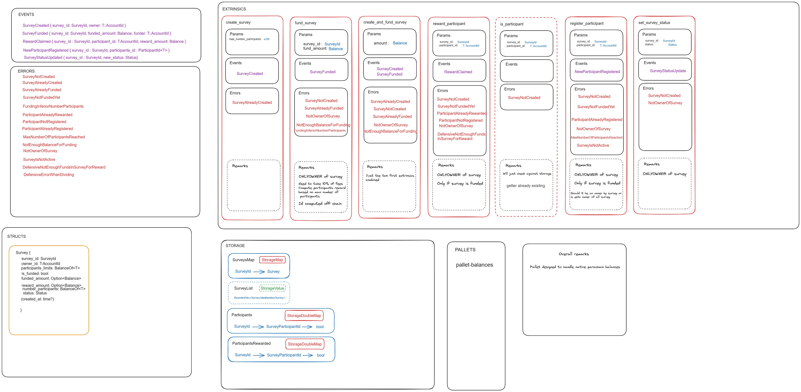

# Pallet Survey Functionnality for QSTN

# Run demo app

## Clone the repo:

`git clone https://github.com/QSTN-US/Polkadot-QSTN-v1.git`

## Build the substrate node:
Go inside the directory

`cd qstn-substrate-node/substrate-node`

Build using cargo (this will take some time)

`cargo build --release`

## Build the front-end
On antother terminal go inside the front-end repository and install dependencies

`yarn`

Build the project

`yarn build`

## Start the node
Start the node while in the node repository with

`./target/release/node-template --dev`

## Start the frontend
Start the front-end in another terminal while in the front-end repository with

`yarn start`

This should open automatically the front-end in localhost on your browser.

# Documentation

Inline documentation is present in the pallet code. Every function is detailed. 

You should be able to see the docs with `cargo doc`

